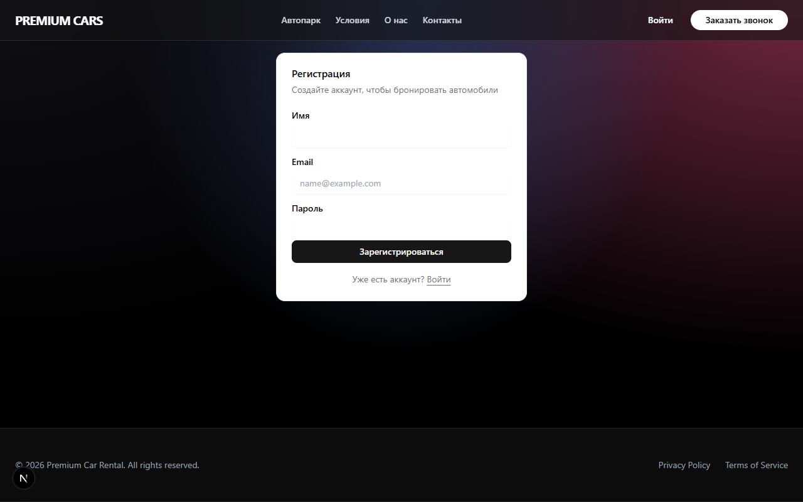

# Premium Car Rental Service

Современная Full-stack платформа для аренды автомобилей премиум-класса. Проект реализован как высокопроизводительное веб-приложение с полноценной админ-панелью, системой бронирования и аутентификацией.

## 🚀 Технологический стек

- **Framework:** Next.js 16 (App Router)
- **Language:** TypeScript
- **Styling:** Tailwind CSS 4
- **Database:** PostgreSQL / SQLite (Prisma ORM)
- **Auth:** Auth.js v5 (NextAuth)
- **Animations:** Framer Motion
- **Notifications:** Telegram Bot API
- **UI Components:** Radix UI / Shadcn UI

## ✨ Основные возможности

### Для пользователей:
- **Каталог авто:** Плавный интерфейс с фильтрацией и детальными страницами.
- **Система бронирования:** Интерактивный календарь с проверкой доступности дат в реальном времени.
- **Личный кабинет:** История заказов, управление профилем.
- **Аутентификация:** Вход через Email/Пароль и Google OAuth.
- **SEO:** Динамические мета-теги и JSON-LD разметка для каждой машины.

### Для администратора:
- **Dashboard:** Статистика и ключевые метрики.
- **Управление автопарком:** Полный CRUD (создание, чтение, обновление, удаление) автомобилей.
- **Календарь занятости:** Визуальная сетка всех бронирований.
- **Уведомления:** Мгновенные уведомления о новых заявках в Telegram.

## 📸 Скриншоты

| Главная страница | Детальная страница авто |
|---|---|
|  |  |

| Админ-панель | Календарь бронирований |
|---|---|
|  |  |

## 🛠 Установка и запуск

1. Клонируйте репозиторий:
   ```bash
   git clone https://github.com/your-username/premium-car-rental.git
   ```
2. Установите зависимости:
   ```bash
   npm install
   ```
3. Настройте переменные окружения (`.env`):
   ```env
   DATABASE_URL="file:./dev.db"
   AUTH_SECRET="your-secret"
   TELEGRAM_BOT_TOKEN="your-token"
   TELEGRAM_CHAT_ID="your-id"
   ```
4. Запустите миграции БД:
   ```bash
   npx prisma migrate dev
   ```
5. Запустите проект:
   ```bash
   npm run dev
   ```

---
*Разработано для портфолио как пример высококачественного бизнес-решения.*
