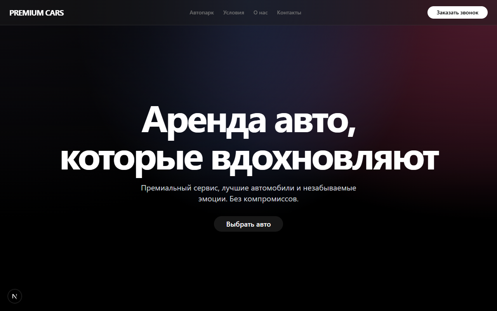
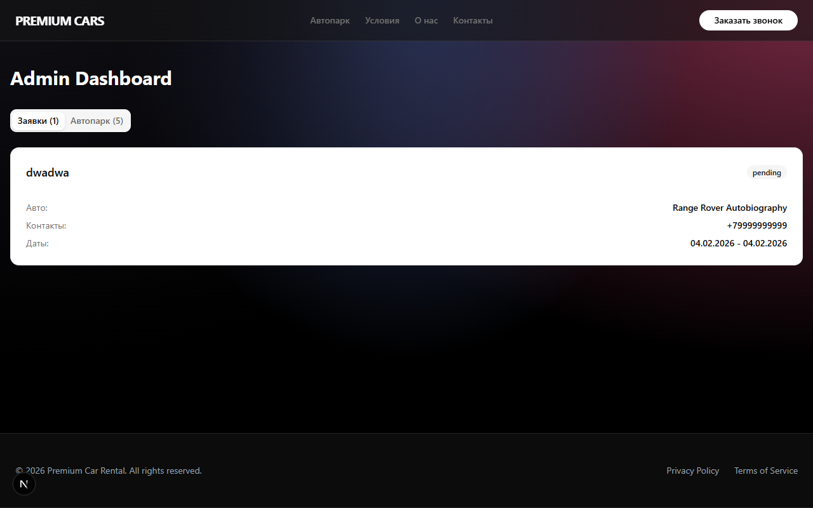

# Premium Car Rental

This is a full-stack web application for a premium car rental service. It features a public-facing site for browsing and booking cars, and a comprehensive admin panel for managing the fleet, bookings, and users.

## Key Features

*   **Modern User Interface:** Sleek, responsive design built with Next.js, Tailwind CSS, and Framer Motion.
*   **Car Fleet Showcase:** Browse available premium vehicles with detailed specifications.
*   **Admin Dashboard:** A secure area for administrators to manage the application's data.
*   **Full CRUD for Cars:** Admins can create, read, update, and delete car listings.
*   **User Authentication:** Secure login and registration system using NextAuth.js, supporting both credentials and Google OAuth.
*   **Database Management:** Uses Prisma as an ORM for easy and safe database access.

## Screenshots

### Home Page


### Admin Panel


## Tech Stack

*   **Framework:** [Next.js](https://nextjs.org/)
*   **Styling:** [Tailwind CSS](https://tailwindcss.com/)
*   **Authentication:** [NextAuth.js](https://next-auth.js.org/)
*   **Database ORM:** [Prisma](https://www.prisma.io/)
*   **UI Components:** [Shadcn/UI](https://ui.shadcn.com/)
*   **Animations:** [Framer Motion](https://www.framer.com/motion/)
*   **Language:** [TypeScript](https://www.typescriptlang.org/)

## Getting Started

### Prerequisites

*   Node.js (v18 or later)
*   npm / yarn / pnpm
*   A running PostgreSQL, MySQL, or SQLite database.

### Installation

1.  **Clone the repository:**
    ```bash
    git clone https://github.com/S0R4-J/car.git
    cd car
    ```

2.  **Install dependencies:**
    ```bash
    npm install
    ```

3.  **Set up your environment variables:**
    *   Copy the `.env.example` file to a new file named `.env.local`.
    *   ```bash
      *   cp .env.example .env.local
      *   ```
    *   Fill in the required variables, especially your `DATABASE_URL` and NextAuth `NEXTAUTH_SECRET`.

4.  **Apply database migrations:**
    ```bash
    npx prisma migrate dev
    ```

5.  **Seed the database with initial data (including an admin user):**
    ```bash
    npx prisma db seed
    ```
    *Admin credentials are: `admin@example.com` / `password123`*

6.  **Run the development server:**
    ```bash
    npm run dev
    ```

Open [http://localhost:3000](http://localhost:3000) with your browser to see the result.
